# API Data Flow Diagram

```mermaid
graph TB
    %% Authentication & User Management Flow
    Auth_Register["POST /auth/register<br/>Request: UserCreate<br/>Response: UserResponse"] --> User_Token["UserResponse.id<br/>organization_id"]
    Auth_Login["POST /auth/login<br/>Request: LoginRequest<br/>Response: LoginResponse/MFARequired"] --> User_Token
    Auth_MFA["POST /auth/verify-mfa<br/>Request: VerifyMFARequest<br/>Response: LoginResponse"] --> User_Token
    Auth_Me["GET /auth/me<br/>Response: UserResponse"] --> User_Token
    
    User_Token --> |user_id, organization_id|Patient_Ops["Patient Operations"]
    User_Token --> |user_id, organization_id|Doctor_Ops["Doctor Operations"]
    User_Token --> |user_id, organization_id|Org_Ops["Organization Operations"]
    
    %% Patient CRUD Flow
    Patient_Ops --> Patient_Create["POST /patients<br/>Request: PatientCreate<br/>Response: PatientResponse"]
    Patient_Ops --> Patient_List["GET /patients<br/>Response: PatientListResponse"]
    Patient_Ops --> Patient_Get["GET /patients/:patient_id<br/>Response: PatientResponse"]
    Patient_Ops --> Patient_Update["PUT /patients/:patient_id<br/>Request: PatientUpdate<br/>Response: PatientResponse"]
    
    Patient_Create --> Patient_Record["PatientResponse.id<br/>mrn, organization_id"]
    Patient_Get --> Patient_Record
    Patient_Update --> Patient_Record
    Patient_List --> Patient_Record
    
    %% Patient Record flows into multiple domains
    Patient_Record --> |patient_id|Documents_Domain["Documents Domain"]
    Patient_Record --> |patient_id|Appointments_Domain["Appointments Domain"]
    Patient_Record --> |patient_id|Medical_History_Domain["Medical History Domain"]
    Patient_Record --> |patient_id|Permissions_Domain["Permissions Domain"]
    Patient_Record --> |patient_id|AI_Processing["AI Processing Domain"]
    
    %% Doctor Operations
    Doctor_Ops --> Doctor_Onboard["POST /doctor/onboard-patient<br/>Request: PatientOnboard<br/>Response: PatientResponse+User"]
    Doctor_Onboard --> Patient_Record
    Doctor_Onboard --> User_Token
    
    Doctor_Ops --> Doctor_Profile["PATCH /doctor/profile<br/>Request: DoctorProfileUpdate"]
    Doctor_Ops --> Doctor_Search["GET /doctors/search<br/>Response: DoctorSearchResponse"]
    Doctor_Ops --> Doctor_Patients["GET /doctor/patients<br/>Response: DoctorPatientListItem[]"]
    Doctor_Ops --> Doctor_Tasks["GET/POST /doctor/tasks<br/>Request: TaskCreate<br/>Response: TaskResponse"]
    
    Doctor_Search --> Doctor_Record["DoctorSearchItem.id<br/>specialty"]
    Doctor_Patients --> Patient_Record
    
    %% Documents Domain
    Documents_Domain --> Doc_Upload_URL["POST /documents/upload-url<br/>Request: DocumentUploadRequest<br/>Response: DocumentUploadResponse"]
    Documents_Domain --> Doc_Upload["POST /documents/upload<br/>Multipart Form: file, patient_id<br/>Response: DocumentResponse"]
    Documents_Domain --> Doc_List["GET /documents?patient_id=X<br/>Response: DocumentListResponse"]
    Documents_Domain --> Doc_Get["GET /documents/:document_id<br/>Response: DocumentResponse"]
    Documents_Domain --> Doc_Confirm["POST /documents/:document_id/confirm<br/>Request: DocumentConfirmRequest<br/>Response: DocumentResponse"]
    
    Doc_Upload_URL --> Doc_Record["DocumentResponse.id<br/>patientId, uploadedBy"]
    Doc_Upload --> Doc_Record
    Doc_Confirm --> Doc_Record
    Doc_Get --> Doc_Record
    Doc_List --> Doc_Record
    
    %% Medical History Domain
    Medical_History_Domain --> MH_Upload["POST /doctor/medical-history<br/>Multipart: file, patient_id, category<br/>Response: MedicalHistoryResponse"]
    Medical_History_Domain --> MH_Get["GET /doctor/patients/:patient_id/documents<br/>Response: MedicalHistoryResponse[]"]
    
    MH_Upload --> MH_Record["MedicalHistoryResponse.id<br/>patient_id, category, presigned_url"]
    MH_Get --> MH_Record
    
    %% Document Record flows to AI Processing
    Doc_Record --> |document_id, patient_id|AI_Processing
    MH_Record --> |document_id, patient_id|AI_Processing
    
    %% Permissions Domain
    Permissions_Domain --> Perm_Request["POST /permissions/request<br/>Request: RequestAccessRequest<br/>Response: DataAccessGrant"]
    Permissions_Domain --> Perm_Grant["POST /permissions/grant-doctor-access<br/>Request: GrantAccessRequest<br/>Response: DataAccessGrant"]
    Permissions_Domain --> Perm_Check["GET /permissions/check?patient_id=X<br/>Response: CheckPermissionResponse"]
    Permissions_Domain --> Perm_Revoke["DELETE /permissions/revoke-doctor-access<br/>Request: RevokeAccessRequest"]
    
    Patient_Record --> |patient_id|Perm_Request
    Doctor_Record --> |doctor_id|Perm_Request
    Patient_Record --> |patient_id|Perm_Grant
    Doctor_Record --> |doctor_id|Perm_Grant
    
    Perm_Request --> Permission_Grant["DataAccessGrant<br/>doctor_id, patient_id, status"]
    Perm_Grant --> Permission_Grant
    Perm_Check --> Permission_Grant
    Perm_Revoke -.->|deletes|Permission_Grant
    
    Permission_Grant --> |has_permission|MH_Get
    Permission_Grant --> |has_permission|AI_Processing
    
    %% Appointments Domain
    Appointments_Domain --> Appt_Create["POST /appointments<br/>Request: AppointmentCreate<br/>Response: AppointmentResponse"]
    Appointments_Domain --> Appt_Request["POST /appointments/request<br/>Request: AppointmentCreate<br/>Response: AppointmentResponse"]
    Appointments_Domain --> Appt_Approve["POST /appointments/:id/approve<br/>Request: AppointmentApproval<br/>Response: AppointmentResponse"]
    Appointments_Domain --> Appt_Status["PATCH /appointments/:id/status<br/>Request: AppointmentStatusUpdate<br/>Response: AppointmentResponse"]
    Appointments_Domain --> Appt_Get_Patient["GET /appointments/patient-appointments<br/>Response: AppointmentResponse[]"]
    Appointments_Domain --> Appt_Get_Doctor["GET /doctor/appointments<br/>Response: AppointmentResponse[]"]
    
    Patient_Record --> |patient_id|Appt_Create
    Doctor_Record --> |doctor_id|Appt_Create
    
    Appt_Create --> Appt_Record["AppointmentResponse<br/>id, patient_id, doctor_id<br/>meeting_id, join_url"]
    Appt_Request --> Appt_Record
    Appt_Approve --> Appt_Record
    Appt_Status --> Appt_Record
    Appt_Get_Patient --> Appt_Record
    Appt_Get_Doctor --> Appt_Record
    
    %% Appointments can trigger access grants
    Appt_Create --> |grant_access_to_history=true|Perm_Grant
    
    %% Consultations Domain
    Appt_Record --> |appointment_id|Consultation_Domain["Consultations Domain"]
    Consultation_Domain --> Consult_Create["POST /consultations<br/>Request: ConsultationCreate<br/>Response: ConsultationResponse"]
    Consultation_Domain --> Consult_List["GET /consultations<br/>Response: ConsultationListResponse"]
    Consultation_Domain --> Consult_Get["GET /consultations/:id<br/>Response: ConsultationResponse"]
    Consultation_Domain --> Consult_Update["PUT /consultations/:id<br/>Request: ConsultationUpdate<br/>Response: ConsultationResponse"]
    
    Patient_Record --> |patientId|Consult_Create
    Doctor_Record --> |doctorId|Consult_Create
    
    Consult_Create --> Consult_Record["ConsultationResponse<br/>id, patientId, doctorId<br/>meetingId, aiStatus"]
    Consult_Get --> Consult_Record
    Consult_Update --> Consult_Record
    Consult_List --> Consult_Record
    
    %% AI Processing Domain
    AI_Processing --> AI_Process_Doc["POST /doctor/ai/process-document<br/>Request: DocumentProcessRequest<br/>Response: DocumentProcessResponse"]
    AI_Processing --> AI_Chat_Patient["POST /doctor/ai/chat/patient<br/>Request: ChatRequest"]
    AI_Processing --> AI_Chat_Doctor["POST /doctor/ai/chat/doctor<br/>Request: DoctorChatRequest"]
    AI_Processing --> AI_History_Patient["GET /doctor/ai/chat-history/patient?patient_id=X"]
    AI_Processing --> AI_History_Doctor["GET /doctor/ai/chat-history/doctor?patient_id=X"]
    
    Doc_Record --> |document_id|AI_Process_Doc
    Patient_Record --> |patient_id|AI_Process_Doc
    Permission_Grant --> |verifies access|AI_Process_Doc
    
    AI_Process_Doc --> AI_Job["DocumentProcessResponse<br/>job_id, status"]
    
    Patient_Record --> |patient_id|AI_Chat_Patient
    Doc_Record --> |document_id|AI_Chat_Patient
    Patient_Record --> |patient_id|AI_Chat_Doctor
    Doctor_Record --> |doctor_id|AI_Chat_Doctor
    
    AI_Chat_Patient --> Conversation_Record["Conversation History<br/>conversation_id, patient_id"]
    AI_Chat_Doctor --> Conversation_Record
    AI_History_Patient --> Conversation_Record
    AI_History_Doctor --> Conversation_Record
    
    %% Organization & Team Management
    Org_Ops --> Org_Get["GET /organization<br/>Response: OrganizationResponse"]
    Org_Ops --> Org_Members["GET /organization/members<br/>Response: MemberResponse[]"]
    Org_Ops --> Org_Invite["POST /organization/invitations<br/>Request: InvitationCreate<br/>Response: InvitationResponse"]
    Org_Ops --> Org_Accept["POST /organization/invitations/accept<br/>Request: InvitationAccept<br/>Response: MemberResponse"]
    
    Org_Get --> Org_Record["OrganizationResponse<br/>id, name, subscription_tier"]
    User_Token --> |organization_id|Org_Record
    
    Org_Invite --> Invitation_Record["InvitationResponse<br/>id, email, role, status"]
    Org_Accept --> Invitation_Record
    Org_Accept --> User_Token
    
    Org_Members --> Member_Record["MemberResponse<br/>id, role, organization_id"]
    Org_Record --> |organization_id|Member_Record
    
    %% Team Management
    User_Token --> Team_Invite["POST /team/invite<br/>Request: TeamInviteCreate"]
    Team_Invite --> Invitation_Record
    
    User_Token --> Team_Roles["GET /team/roles<br/>Response: TeamRole[]"]
    
    %% Admin Operations
    User_Token --> |role=admin|Admin_Ops["Admin Operations"]
    Admin_Ops --> Admin_Overview["GET /admin/overview<br/>Response: AdminOverviewResponse"]
    Admin_Ops --> Admin_Settings["GET /admin/settings<br/>Response: AllSettingsResponse"]
    Admin_Ops --> Admin_Update_Settings["PATCH /admin/settings/organization<br/>Request: OrgSettingsUpdate"]
    Admin_Ops --> Admin_Accounts["GET /admin/accounts<br/>Response: AccountListItem[]"]
    Admin_Ops --> Admin_Invite["POST /admin/invite<br/>Request: InviteRequest"]
    Admin_Ops --> Admin_Revoke["DELETE /admin/accounts/:id"]
    
    Admin_Overview --> Activity_Feed["ActivityFeedItem[]<br/>SystemAlert[], StorageStats"]
    Admin_Accounts --> Account_Records["AccountListItem<br/>id, email, role, status"]
    Admin_Invite --> Invitation_Record
    
    Org_Record --> |organization_id|Admin_Overview
    Member_Record --> Account_Records
    Invitation_Record --> Account_Records
    
    %% Audit & Compliance
    User_Token --> Audit_Ops["Audit Operations"]
    Audit_Ops --> Audit_Logs["GET /audit/logs<br/>Response: AuditLogListResponse"]
    Audit_Ops --> Audit_Export["GET /audit/export"]
    Audit_Ops --> Audit_Stats["GET /audit/stats<br/>Response: ComplianceReport"]
    
    Audit_Logs --> Audit_Record["AuditLogResponse<br/>user_id, action, resource_id"]
    User_Token --> |user_id|Audit_Record
    Patient_Record --> |resource_id|Audit_Record
    Doc_Record --> |resource_id|Audit_Record
    Appt_Record --> |resource_id|Audit_Record
    Permission_Grant --> |creates audit log|Audit_Record
    
    User_Token --> Compliance_Ops["Compliance Operations"]
    Compliance_Ops --> GDPR_Download["GET /compliance/my-data"]
    Compliance_Ops --> GDPR_Delete["DELETE /compliance/my-account"]
    
    User_Token --> |user_id|GDPR_Download
    User_Token --> |user_id|GDPR_Delete
    
    %% Styling
    classDef authClass fill:#e1f5ff,stroke:#01579b,stroke-width:2px
    classDef patientClass fill:#f3e5f5,stroke:#4a148c,stroke-width:2px
    classDef doctorClass fill:#e8f5e9,stroke:#1b5e20,stroke-width:2px
    classDef docClass fill:#fff3e0,stroke:#e65100,stroke-width:2px
    classDef aiClass fill:#fce4ec,stroke:#880e4f,stroke-width:2px
    classDef permClass fill:#fff9c4,stroke:#f57f17,stroke-width:2px
    classDef apptClass fill:#e0f2f1,stroke:#004d40,stroke-width:2px
    classDef adminClass fill:#ffe0b2,stroke:#e65100,stroke-width:2px
    classDef auditClass fill:#f1f8e9,stroke:#33691e,stroke-width:2px
    
    class Auth_Register,Auth_Login,Auth_MFA,Auth_Me,User_Token authClass
    class Patient_Create,Patient_List,Patient_Get,Patient_Update,Patient_Record,Patient_Ops patientClass
    class Doctor_Ops,Doctor_Onboard,Doctor_Profile,Doctor_Search,Doctor_Patients,Doctor_Tasks,Doctor_Record doctorClass
    class Documents_Domain,Doc_Upload,Doc_Upload_URL,Doc_List,Doc_Get,Doc_Confirm,Doc_Record docClass
    class Medical_History_Domain,MH_Upload,MH_Get,MH_Record docClass
    class AI_Processing,AI_Process_Doc,AI_Chat_Patient,AI_Chat_Doctor,AI_History_Patient,AI_History_Doctor,AI_Job,Conversation_Record aiClass
    class Permissions_Domain,Perm_Request,Perm_Grant,Perm_Check,Perm_Revoke,Permission_Grant permClass
    class Appointments_Domain,Appt_Create,Appt_Request,Appt_Approve,Appt_Status,Appt_Get_Patient,Appt_Get_Doctor,Appt_Record apptClass
    class Consultation_Domain,Consult_Create,Consult_List,Consult_Get,Consult_Update,Consult_Record apptClass
    class Org_Ops,Org_Get,Org_Members,Org_Invite,Org_Accept,Org_Record,Member_Record,Invitation_Record,Team_Invite,Team_Roles adminClass
    class Admin_Ops,Admin_Overview,Admin_Settings,Admin_Update_Settings,Admin_Accounts,Admin_Invite,Admin_Revoke,Activity_Feed,Account_Records adminClass
    class Audit_Ops,Audit_Logs,Audit_Export,Audit_Stats,Audit_Record,Compliance_Ops,GDPR_Download,GDPR_Delete auditClass
```

## API Data Flow Summary

### Key Data Entities & Their Flow:

1. **User/Auth Flow** (`user_id`, `organization_id`):
   - Originates from registration/login
   - Flows into ALL domain operations
   - Controls access permissions

2. **Patient Records** (`patient_id`, `mrn`):
   - Created via `/patients` or `/doctor/onboard-patient`
   - Flows into: Documents, Medical History, Appointments, Permissions, AI Processing

3. **Doctor Records** (`doctor_id`, `specialty`):
   - Created via user onboarding
   - Flows into: Appointments, Permissions, AI Processing, Tasks

4. **Documents** (`document_id`, `patient_id`):
   - Created via document upload endpoints
   - Flows into: AI Processing, Medical History retrieval
   - Protected by Permissions

5. **Permissions** (`doctor_id`, `patient_id`, `status`):
   - Created via request/grant flow
   - Gates access to: Medical History, AI Processing
   - Status values: `pending`, `active`, `revoked`

6. **Appointments** (`appointment_id`, `meeting_id`):
   - Created by patient, approved by doctor
   - Can trigger automatic permission grants
   - Flows into: Consultations, Zoom integration

7. **AI Processing** (`job_id`, `conversation_id`):
   - Requires: `document_id`, `patient_id`, `permission`
   - Produces: Conversation history, processed documents

8. **Organizations** (`organization_id`):
   - Root entity for multi-tenancy
   - All users, patients, doctors belong to an org
   - Controls team management and invitations

### Critical Permission Checks:
- `GET /doctor/patients/:patient_id/documents` → Checks `DataAccessGrant`
- `POST /doctor/ai/process-document` → Checks `DataAccessGrant`
- All document operations → Verifies `Patient.created_by == current_user.id`

### Audit Trail:
- All operations involving PHI (Protected Health Information) create `AuditLogResponse` entries
- Tracked fields: `user_id`, `action`, `resource_id`, `resource_type`

### Color Legend:
- 🔵 **Blue**: Authentication & User Management
- 🟣 **Purple**: Patient Operations
- 🟢 **Green**: Doctor Operations
- 🟠 **Orange**: Documents & Medical History
- 🔴 **Pink**: AI Processing
- 🟡 **Yellow**: Permissions & Access Control
- 🔷 **Teal**: Appointments & Consultations
- 🟤 **Tan**: Admin & Organization
- 🟩 **Light Green**: Audit & Compliance
