# Consultations API Workflow & Dependency Graph

This diagram shows the complete end-to-end workflow for consultation management APIs, including creating, updating, and managing consultations with AI integration.

## Complete Workflow: From Registration to Consultation Management

```mermaid
graph TB
    Start([Start: New User]) --> Register
    
    %% Phase 1: Authentication Setup
    Register["1. POST /auth/register<br/>Request: UserCreate<br/>📤 email, password, role<br/>📥 UserResponse"]
    Register --> |user.id ✓<br/>user.email ✓|Login
    
    Login["2. POST /auth/login<br/>Request: LoginRequest<br/>📤 email, password<br/>📥 LoginResponse"]
    Login --> |access_token ✓<br/>user.id ✓|Auth_Token
    
    Auth_Token{{"🔑 Authentication Token<br/>access_token<br/>user.id<br/>organization_id"}}
    
    %% Phase 2: Patient & Doctor Setup
    Auth_Token --> |Bearer token|Create_Patient
    Create_Patient["3. POST /patients<br/>OR POST /doctor/onboard-patient<br/>📤 Authorization: Bearer token<br/>📤 patient details<br/>📥 PatientResponse"]
    Create_Patient --> |patient.id ✓<br/>patient.mrn ✓|Patient_ID
    
    Patient_ID{{"👤 Patient Record<br/>patient_id (UUID)<br/>mrn<br/>created_by (doctor_id)"}}
    
    Auth_Token --> |if role=doctor|Doctor_ID
    Doctor_ID{{"👨‍⚕️ Doctor Identity<br/>doctor_id (user.id)<br/>specialty<br/>organization_id"}}
    
    %% Phase 3: Create Consultation
    Patient_ID --> |patientId|Create_Consult
    Doctor_ID --> |doctorId|Create_Consult
    Auth_Token --> |Bearer token|Create_Consult
    
    Create_Consult["4. POST /consultations<br/>Request: ConsultationCreate<br/>📤 Authorization: Bearer token<br/>📤 patientId (from step 3)<br/>📤 doctorId (from doctor user)<br/>📤 scheduledAt, duration<br/>📤 consultationType, meetingLink<br/>📤 aiSummaryEnabled (optional)<br/>📥 ConsultationResponse"]
    Create_Consult --> |consultation.id ✓<br/>meetingId ✓<br/>status=scheduled|Consultation_Record
    
    Consultation_Record{{"📋 Consultation Created<br/>id (UUID)<br/>patientId<br/>doctorId<br/>meetingId (if Zoom)<br/>status: scheduled<br/>aiStatus: pending"}}
    
    %% Phase 4: Consultation Operations
    Consultation_Record --> |consultation_id|Consult_Ops
    
    Consult_Ops{{"Consultation Operations<br/>Using consultation_id"}}
    
    %% Get Single Consultation
    Consult_Ops --> Get_Consult
    Get_Consult["GET /consultations/:id<br/>📤 Authorization: Bearer token<br/>📤 consultation_id<br/>📥 ConsultationResponse<br/>📥 Full details + notes + summary"]
    Get_Consult --> Consult_Detail
    
    Consult_Detail{{"📄 Consultation Details<br/>All fields from creation<br/>+ notes, aiSummary<br/>+ actualStartTime<br/>+ actualEndTime"}}
    
    %% List Consultations
    Consult_Ops --> List_Consult
    List_Consult["GET /consultations<br/>📤 Authorization: Bearer token<br/>📤 Query params:<br/>  - patient_id (optional)<br/>  - doctor_id (optional)<br/>  - status (optional)<br/>  - from_date, to_date<br/>📥 ConsultationListResponse"]
    List_Consult --> Consult_Array
    
    Consult_Array{{"📚 Consultation List<br/>Array of ConsultationResponse<br/>Filtered by query params<br/>Paginated results"}}
    
    %% Update Consultation
    Consult_Ops --> Update_Consult
    Consultation_Record --> |consultation_id|Update_Consult
    Auth_Token --> |Bearer token|Update_Consult
    
    Update_Consult["PUT /consultations/:id<br/>Request: ConsultationUpdate<br/>📤 Authorization: Bearer token<br/>📤 consultation_id<br/>📤 Fields to update:<br/>  - status<br/>  - notes<br/>  - actualStartTime<br/>  - actualEndTime<br/>  - aiSummary<br/>📥 ConsultationResponse"]
    Update_Consult --> Updated_Consult
    
    Updated_Consult{{"✏️ Updated Consultation<br/>Modified fields<br/>Updated status<br/>timestamp updated"}}
    
    %% Status Transitions
    Updated_Consult --> Status_Flow
    Status_Flow["Status Transitions:<br/>scheduled → in_progress<br/>in_progress → completed<br/>scheduled → cancelled<br/>* → rescheduled"]
    
    %% AI Processing Integration
    Consultation_Record --> |if aiSummaryEnabled=true|AI_Process
    Updated_Consult --> |if status=completed|AI_Process
    
    AI_Process["AI Summary Processing<br/>Triggered when:<br/>- Consultation completed<br/>- aiSummaryEnabled=true"]
    AI_Process --> AI_Status
    
    AI_Status{{"🤖 AI Processing Status<br/>aiStatus values:<br/>- pending<br/>- processing<br/>- completed<br/>- failed"}}
    
    AI_Status --> |aiStatus=completed|Get_Consult
    
    %% Delete/Cancel
    Consult_Ops --> Delete_Consult
    Delete_Consult["DELETE /consultations/:id<br/>📤 Authorization: Bearer token<br/>📤 consultation_id<br/>📥 204 No Content"]
    
    %% Patient & Doctor Views
    Patient_ID --> |patient_id|Patient_Consults
    Patient_Consults["GET /consultations?patient_id=X<br/>📥 All consultations for patient"]
    
    Doctor_ID --> |doctor_id|Doctor_Consults
    Doctor_Consults["GET /consultations?doctor_id=X<br/>📥 All consultations for doctor"]
    
    %% Styling
    classDef authStep fill:#e3f2fd,stroke:#1976d2,stroke-width:2px
    classDef setupStep fill:#f3e5f5,stroke:#7b1fa2,stroke-width:2px
    classDef createStep fill:#e8f5e9,stroke:#388e3c,stroke-width:2px
    classDef readStep fill:#fff3e0,stroke:#f57c00,stroke-width:2px
    classDef updateStep fill:#fce4ec,stroke:#c2185b,stroke-width:2px
    classDef aiStep fill:#ede7f6,stroke:#512da8,stroke-width:2px
    classDef dataNode fill:#fff9c4,stroke:#f9a825,stroke-width:3px
    classDef statusNode fill:#e0f2f1,stroke:#00796b,stroke-width:2px
    
    class Register,Login,Auth_Token authStep
    class Create_Patient,Patient_ID,Doctor_ID setupStep
    class Create_Consult,Consultation_Record createStep
    class Get_Consult,List_Consult,Consult_Detail,Consult_Array,Patient_Consults,Doctor_Consults readStep
    class Update_Consult,Updated_Consult,Delete_Consult,Status_Flow updateStep
    class AI_Process,AI_Status aiStep
    class Consult_Ops dataNode
```



## API Dependency Table

| Step | API Endpoint | Dependencies (Required Inputs) | Outputs Used By Next Steps |
|------|-------------|--------------------------------|----------------------------|
| **1** | `POST /auth/register` | None (starting point) | ✅ `user.id`, `user.email` |
| **2** | `POST /auth/login` | ⬅️ `email` (from step 1)<br/>⬅️ `password` (from step 1) | ✅ `access_token` (all subsequent)<br/>✅ `user.id` = `doctor_id` |
| **3** | `POST /patients` | ⬅️ `access_token` (from step 2) | ✅ `patient_id` (step 4) |
| **4** | `POST /consultations` | ⬅️ `access_token` (from step 2)<br/>⬅️ `patientId` (from step 3)<br/>⬅️ `doctorId` (from step 2, user.id) | ✅ `consultation_id`<br/>✅ `meetingId`<br/>✅ `status` |
| **Get** | `GET /consultations/:id` | ⬅️ `access_token` (from step 2)<br/>⬅️ `consultation_id` (from step 4) | ✅ Full `ConsultationResponse` |
| **List** | `GET /consultations` | ⬅️ `access_token` (from step 2)<br/>⬅️ Query filters (optional) | ✅ Array of consultations |
| **Update** | `PUT /consultations/:id` | ⬅️ `access_token` (from step 2)<br/>⬅️ `consultation_id` (from step 4)<br/>⬅️ Update fields | ✅ Updated `ConsultationResponse` |
| **Delete** | `DELETE /consultations/:id` | ⬅️ `access_token` (from step 2)<br/>⬅️ `consultation_id` (from step 4) | ✅ 204 status |

## Consultation Status Lifecycle


## Request/Response Schemas

### ConsultationCreate (Request)
```json
{
  "patientId": "uuid",           // Required: from step 3
  "doctorId": "uuid",            // Required: from step 2 (user.id)
  "scheduledAt": "ISO8601",      // Required: future datetime
  "duration": 30,                // Required: minutes
  "consultationType": "video",   // Required: "video", "audio", "in_person"
  "meetingLink": "https://...",  // Optional: auto-generated for Zoom
  "notes": "Initial notes",      // Optional
  "aiSummaryEnabled": true       // Optional: default false
}
```

### ConsultationResponse
```json
{
  "id": "uuid",
  "patientId": "uuid",
  "doctorId": "uuid",
  "patient": {                   // Populated patient object
    "id": "uuid",
    "fullName": "John Doe",
    "mrn": "MRN001"
  },
  "doctor": {                    // Populated doctor object
    "id": "uuid",
    "fullName": "Dr. Smith",
    "specialty": "Cardiology"
  },
  "scheduledAt": "2024-01-15T10:00:00Z",
  "duration": 30,
  "consultationType": "video",
  "status": "scheduled",         // scheduled, in_progress, completed, cancelled, rescheduled
  "meetingId": "zoom-meeting-id",
  "meetingLink": "https://zoom.us/...",
  "notes": "Patient history reviewed",
  "actualStartTime": "2024-01-15T10:05:00Z",
  "actualEndTime": "2024-01-15T10:35:00Z",
  "aiSummary": "AI-generated summary",
  "aiStatus": "completed",       // pending, processing, completed, failed
  "createdAt": "2024-01-10T12:00:00Z",
  "updatedAt": "2024-01-15T10:35:00Z"
}
```

### ConsultationUpdate (Request)
```json
{
  "status": "completed",                      // Optional
  "notes": "Follow-up required",              // Optional
  "actualStartTime": "ISO8601",               // Optional
  "actualEndTime": "ISO8601",                 // Optional
  "aiSummary": "Generated summary",           // Optional (usually set by AI)
  "aiStatus": "completed"                     // Optional (usually set by AI)
}
```

## Key Features & Rules

### Authorization Rules
- **Who can create?** Both patients and doctors
- **Who can update?** Doctor or patient involved in the consultation
- **Who can delete?** Doctor or patient involved in the consultation
- **Who can view?** 
  - Doctor: See all their consultations
  - Patient: See all their consultations
  - Admin: See all in organization

### AI Summary Integration
1. **Enabled when:** `aiSummaryEnabled: true` in creation
2. **Triggered when:** Consultation status changes to `completed`
3. **Processing states:**
   - `pending` → Initial state
   - `processing` → AI is generating summary
   - `completed` → Summary available in `aiSummary` field
   - `failed` → Processing error

### Meeting Integration (Zoom)
- If `consultationType: "video"` and no `meetingLink` provided:
  - Backend auto-generates Zoom meeting
  - Returns `meetingId` and `meetingLink`
- For in-person consultations, `meetingLink` is null

### Query Filters (GET /consultations)
```
?patient_id=uuid          // Filter by patient
?doctor_id=uuid           // Filter by doctor
?status=scheduled         // Filter by status
?from_date=2024-01-01     // Start date range
?to_date=2024-01-31       // End date range
?page=1                   // Pagination
?limit=20                 // Items per page
```

## Complete Example Flow (curl commands)

```bash
# Step 1: Register Doctor
curl -X POST http://localhost:8000/api/v1/auth/register \
  -H "Content-Type: application/json" \
  -d '{
    "email": "doctor@clinic.com",
    "password": "SecurePass123",
    "role": "doctor",
    "full_name": "Dr. Sarah Johnson"
  }'
# Response: {"id": "doctor-uuid", "email": "doctor@clinic.com", ...}

# Step 2: Login
curl -X POST http://localhost:8000/api/v1/auth/login \
  -H "Content-Type: application/json" \
  -d '{
    "email": "doctor@clinic.com",
    "password": "SecurePass123"
  }'
# Response: {"access_token": "eyJ...", "user": {"id": "doctor-uuid", ...}}
# Save: TOKEN="eyJ..." and DOCTOR_ID="doctor-uuid"

# Step 3: Create/Onboard Patient
curl -X POST http://localhost:8000/api/v1/doctor/onboard-patient \
  -H "Authorization: Bearer $TOKEN" \
  -H "Content-Type: application/json" \
  -d '{
    "email": "patient@example.com",
    "full_name": "John Doe",
    "date_of_birth": "1985-05-15",
    "phone": "+1234567890"
  }'
# Response: {"patient": {"id": "patient-uuid", "mrn": "MRN001", ...}, "user": {...}}
# Save: PATIENT_ID="patient-uuid"

# Step 4: Create Consultation
curl -X POST http://localhost:8000/api/v1/consultations \
  -H "Authorization: Bearer $TOKEN" \
  -H "Content-Type: application/json" \
  -d '{
    "patientId": "'$PATIENT_ID'",
    "doctorId": "'$DOCTOR_ID'",
    "scheduledAt": "2024-01-20T14:00:00Z",
    "duration": 30,
    "consultationType": "video",
    "notes": "Initial consultation for cardiac checkup",
    "aiSummaryEnabled": true
  }'
# Response: {"id": "consult-uuid", "meetingLink": "https://zoom.us/...", ...}
# Save: CONSULT_ID="consult-uuid"

# Step 5: Get Consultation Details
curl -X GET http://localhost:8000/api/v1/consultations/$CONSULT_ID \
  -H "Authorization: Bearer $TOKEN"
# Response: Full ConsultationResponse with all details

# Step 6: List All Consultations for Doctor
curl -X GET "http://localhost:8000/api/v1/consultations?doctor_id=$DOCTOR_ID&status=scheduled" \
  -H "Authorization: Bearer $TOKEN"
# Response: {"items": [...], "total": 5, "page": 1, "limit": 20}

# Step 7: Update Consultation (Start Meeting)
curl -X PUT http://localhost:8000/api/v1/consultations/$CONSULT_ID \
  -H "Authorization: Bearer $TOKEN" \
  -H "Content-Type: application/json" \
  -d '{
    "status": "in_progress",
    "actualStartTime": "2024-01-20T14:05:00Z"
  }'
# Response: Updated ConsultationResponse with status="in_progress"

# Step 8: Update Consultation (Complete Meeting)
curl -X PUT http://localhost:8000/api/v1/consultations/$CONSULT_ID \
  -H "Authorization: Bearer $TOKEN" \
  -H "Content-Type: application/json" \
  -d '{
    "status": "completed",
    "actualEndTime": "2024-01-20T14:32:00Z",
    "notes": "Patient shows signs of improvement. Prescribed new medication."
  }'
# Response: Updated ConsultationResponse with status="completed", aiStatus="processing"
# AI summary generation triggered in background

# Step 9: Check AI Summary Status
curl -X GET http://localhost:8000/api/v1/consultations/$CONSULT_ID \
  -H "Authorization: Bearer $TOKEN"
# Response: aiStatus="completed", aiSummary="AI-generated summary of consultation"

# Step 10: Delete/Cancel Consultation
curl -X DELETE http://localhost:8000/api/v1/consultations/$CONSULT_ID \
  -H "Authorization: Bearer $TOKEN"
# Response: 204 No Content
```

## Error Handling

| Error Code | Condition | Resolution |
|------------|-----------|------------|
| `401 Unauthorized` | Missing/invalid token | Re-authenticate (step 2) |
| `403 Forbidden` | Not authorized for this consultation | Verify you're the doctor or patient |
| `404 Not Found` | Invalid consultation_id, patient_id, or doctor_id | Verify IDs from previous steps |
| `409 Conflict` | Doctor/patient scheduling conflict | Check existing consultations, reschedule |
| `422 Validation Error` | Invalid status transition or missing fields | Check request body matches schema |

### Invalid Status Transitions
- ❌ `completed` → `in_progress` (cannot restart)
- ❌ `cancelled` → `in_progress` (cannot resume)
- ✅ `scheduled` → `in_progress` → `completed` (valid flow)
- ✅ `scheduled` → `cancelled` (valid cancellation)
- ✅ `scheduled` → `rescheduled` → `scheduled` (valid reschedule)

## Integration Points

### With Appointments API
Consultations can be created from appointments:
```
POST /appointments → Creates appointment
Appointment approved → Optionally create consultation
```

### With AI Processing API
When consultation completes:
```
PUT /consultations/:id (status=completed)
  ↓
Backend triggers: POST /doctor/ai/process-document
  ↓
AI generates summary
  ↓
PUT /consultations/:id (aiSummary=text, aiStatus=completed)
```

### With Permissions API
Requires active permission grant:
```
Doctor access to patient records
  ↓
DataAccessGrant (status=active)
  ↓
Can create/view consultations
```

## Best Practices

1. **Always check consultation status** before updating
2. **Set actualStartTime** when starting meeting
3. **Set actualEndTime** when completing
4. **Enable AI summary** for automated documentation
5. **Use query filters** to avoid fetching all consultations
6. **Handle Zoom integration** - check meetingLink before launching
7. **Implement optimistic locking** to prevent concurrent updates
8. **Log all status changes** for audit trail
