# Doctor APIs Workflow & Dependency Graph

This diagram shows the complete end-to-end workflow for doctor-specific APIs, including patient management, profile updates, task management, and integration with medical records and AI features.

## Complete Workflow: Doctor Operations from Registration

```mermaid
graph TB
    Start([Start: New Doctor]) --> Register
    
    %% Phase 1: Doctor Authentication & Setup
    Register["1. POST /auth/register<br/>Request: UserCreate<br/>📤 email, password, role=doctor<br/>📤 full_name, specialty<br/>📥 UserResponse"]
    Register --> |user.id = doctor_id ✓<br/>role = doctor ✓|Login
    
    Login["2. POST /auth/login<br/>Request: LoginRequest<br/>📤 email, password<br/>📥 LoginResponse"]
    Login --> |access_token ✓<br/>user.id ✓<br/>organization_id ✓|Auth_Token
    
    Auth_Token{{"🔑 Doctor Authenticated<br/>access_token<br/>doctor_id (user.id)<br/>organization_id<br/>role: doctor"}}
    
    %% Phase 2: Doctor Profile Management
    Auth_Token --> |Bearer token|Profile_Ops
    Profile_Ops{{"Doctor Profile Operations"}}
    
    Profile_Ops --> Update_Profile
    Update_Profile["PATCH /doctor/profile<br/>Request: DoctorProfileUpdate<br/>📤 Authorization: Bearer token<br/>📤 specialty, bio, licenseNumber<br/>📤 languages, consultationFee<br/>📥 DoctorProfileResponse"]
    Update_Profile --> Doctor_Profile
    
    Doctor_Profile{{"👨‍⚕️ Doctor Profile<br/>doctor_id<br/>specialty<br/>licenseNumber<br/>consultationFee<br/>languages[]"}}
    
    %% Phase 3: Patient Management
    Auth_Token --> |Bearer token|Patient_Mgmt
    Patient_Mgmt{{"Patient Management"}}
    
    Patient_Mgmt --> Onboard_Patient
    Onboard_Patient["POST /doctor/onboard-patient<br/>Request: PatientOnboard<br/>📤 Authorization: Bearer token<br/>📤 email, full_name, date_of_birth<br/>📤 phone, address, emergency_contact<br/>📥 PatientResponse + UserResponse"]
    Onboard_Patient --> |patient.id ✓<br/>patient.mrn ✓<br/>patient.created_by = doctor_id|Patient_Record
    
    Patient_Record{{"👤 Patient Onboarded<br/>patient_id<br/>mrn<br/>created_by (doctor_id)<br/>user account created"}}
    
    Patient_Mgmt --> List_Patients
    List_Patients["GET /doctor/patients<br/>📤 Authorization: Bearer token<br/>📤 Query params: search, page<br/>📥 DoctorPatientListItem[]"]
    List_Patients --> Patients_Array
    
    Patients_Array{{"📋 Doctor's Patient List<br/>All patients created by doctor<br/>Includes recent consultations<br/>Paginated results"}}
    
    %% Phase 4: Task Management
    Auth_Token --> |Bearer token|Task_Ops
    Task_Ops{{"Task Management"}}
    
    Task_Ops --> Get_Tasks
    Get_Tasks["GET /doctor/tasks<br/>📤 Authorization: Bearer token<br/>📤 Query: status, priority, patient_id<br/>📥 TaskResponse[]"]
    Get_Tasks --> Tasks_List
    
    Tasks_List{{"📝 Doctor Tasks<br/>Todo items<br/>Follow-ups<br/>Prescriptions to review"}}
    
    Task_Ops --> Create_Task
    Patient_Record --> |patient_id|Create_Task
    Create_Task["POST /doctor/tasks<br/>Request: TaskCreate<br/>📤 Authorization: Bearer token<br/>📤 title, description, patient_id<br/>📤 dueDate, priority, taskType<br/>📥 TaskResponse"]
    Create_Task --> Task_Created
    
    Task_Created{{"✅ Task Created<br/>task_id<br/>patient_id<br/>status: pending<br/>dueDate"}}
    
    %% Phase 5: Medical Records Access
    Auth_Token --> |Bearer token|Medical_Records
    Patient_Record --> |patient_id|Medical_Records
    Medical_Records{{"Medical Records Access<br/>Requires permission"}}
    
    Medical_Records --> Upload_History
    Upload_History["POST /doctor/medical-history<br/>Multipart Form Upload<br/>📤 Authorization: Bearer token<br/>📤 file, patient_id, category<br/>📤 title, description<br/>📥 MedicalHistoryResponse"]
    Upload_History --> |document_id ✓<br/>presigned_url ✓|History_Record
    
    History_Record{{"📄 Medical History Uploaded<br/>document_id<br/>patient_id<br/>category<br/>presigned_url (15 min)"}}
    
    Medical_Records --> Get_Patient_Docs
    Get_Patient_Docs["GET /doctor/patients/:patient_id/documents<br/>📤 Authorization: Bearer token<br/>📤 patient_id<br/>📥 MedicalHistoryResponse[]<br/>⚠️ Requires permission check"]
    Get_Patient_Docs --> |Check DataAccessGrant|Permission_Check
    
    Permission_Check{{"🔐 Permission Verification<br/>Check active permission:<br/>doctor_id + patient_id<br/>status = active"}}
    
    Permission_Check --> |permission granted|Docs_List
    Permission_Check --> |no permission|Access_Denied
    
    Access_Denied["❌ 403 Forbidden<br/>Request permission first"]
    
    Docs_List{{"📚 Patient Documents<br/>All medical history<br/>With download URLs"}}
    
    %% Phase 6: Appointments
    Auth_Token --> |Bearer token|Appt_Ops
    Patient_Record --> |patient_id|Appt_Ops
    Appt_Ops{{"Appointment Operations"}}
    
    Appt_Ops --> Get_Doctor_Appts
    Get_Doctor_Appts["GET /doctor/appointments<br/>📤 Authorization: Bearer token<br/>📤 Query: status, date_from, date_to<br/>📥 AppointmentResponse[]"]
    Get_Doctor_Appts --> Appts_List
    
    Appts_List{{"📅 Doctor's Appointments<br/>Scheduled meetings<br/>By status and date"}}
    
    %% Phase 7: AI Integration
    Auth_Token --> |Bearer token|AI_Ops
    Patient_Record --> |patient_id|AI_Ops
    History_Record --> |document_id|AI_Ops
    Permission_Check --> |permission granted|AI_Ops
    
    AI_Ops{{"AI Processing Operations"}}
    
    AI_Ops --> Process_Doc
    Process_Doc["POST /doctor/ai/process-document<br/>Request: DocumentProcessRequest<br/>📤 Authorization: Bearer token<br/>📤 document_id, patient_id<br/>📤 processing_type<br/>📥 DocumentProcessResponse<br/>⚠️ Requires permission check"]
    Process_Doc --> |job_id ✓<br/>status ✓|AI_Job
    
    AI_Job{{"🤖 AI Processing Job<br/>job_id<br/>status: pending/processing<br/>document analysis"}}
    
    AI_Ops --> Chat_Doctor
    Chat_Doctor["POST /doctor/ai/chat/doctor<br/>Request: DoctorChatRequest<br/>📤 Authorization: Bearer token<br/>📤 patient_id, doctor_id, message<br/>📤 document_ids[]<br/>📥 ChatResponse"]
    Chat_Doctor --> Chat_Response
    
    Chat_Response{{"💬 AI Chat Response<br/>conversation_id<br/>ai_message<br/>context from documents"}}
    
    AI_Ops --> Chat_Patient_View
    Chat_Patient_View["POST /doctor/ai/chat/patient<br/>Request: ChatRequest<br/>📤 Authorization: Bearer token<br/>📤 patient_id, message<br/>📤 document_id (optional)<br/>📥 ChatResponse"]
    Chat_Patient_View --> Chat_Response
    
    AI_Ops --> Get_Chat_History_Doctor
    Get_Chat_History_Doctor["GET /doctor/ai/chat-history/doctor<br/>📤 Authorization: Bearer token<br/>📤 patient_id, doctor_id (query params)<br/>📥 ChatHistoryResponse[]"]
    Get_Chat_History_Doctor --> Chat_History
    
    AI_Ops --> Get_Chat_History_Patient
    Get_Chat_History_Patient["GET /doctor/ai/chat-history/patient<br/>📤 Authorization: Bearer token<br/>📤 patient_id (query param)<br/>📥 ChatHistoryResponse[]"]
    Get_Chat_History_Patient --> Chat_History
    
    Chat_History{{"📜 Conversation History<br/>All AI chat messages<br/>By patient or doctor"}}
    
    %% Phase 8: Doctor Search (Public)
    Auth_Token --> |Bearer token|Search_Doctors
    Search_Doctors["GET /doctors/search<br/>📤 Authorization: Bearer token<br/>📤 Query: specialty, name, location<br/>📥 DoctorSearchResponse"]
    Search_Doctors --> Doctors_Found
    
    Doctors_Found{{"🔍 Found Doctors<br/>Array of doctors<br/>By specialty/name/location"}}
    
    %% Styling
    classDef authStep fill:#e3f2fd,stroke:#1976d2,stroke-width:2px
    classDef profileStep fill:#f3e5f5,stroke:#7b1fa2,stroke-width:2px
    classDef patientStep fill:#e8f5e9,stroke:#388e3c,stroke-width:2px
    classDef taskStep fill:#fff3e0,stroke:#f57c00,stroke-width:2px
    classDef medicalStep fill:#fce4ec,stroke:#c2185b,stroke-width:2px
    classDef apptStep fill:#e0f2f1,stroke:#00796b,stroke-width:2px
    classDef aiStep fill:#ede7f6,stroke:#512da8,stroke-width:2px
    classDef dataNode fill:#fff9c4,stroke:#f9a825,stroke-width:3px
    classDef errorStep fill:#ffebee,stroke:#c62828,stroke-width:2px
    
    class Register,Login,Auth_Token authStep
    class Profile_Ops,Update_Profile,Doctor_Profile,Search_Doctors,Doctors_Found profileStep
    class Patient_Mgmt,Onboard_Patient,Patient_Record,List_Patients,Patients_Array patientStep
    class Task_Ops,Get_Tasks,Create_Task,Tasks_List,Task_Created taskStep
    class Medical_Records,Upload_History,History_Record,Get_Patient_Docs,Docs_List,Permission_Check medicalStep
    class Appt_Ops,Get_Doctor_Appts,Appts_List apptStep
    class AI_Ops,Process_Doc,AI_Job,Chat_Doctor,Chat_Patient_View,Chat_Response,Get_Chat_History_Doctor,Get_Chat_History_Patient,Chat_History aiStep
    class Access_Denied errorStep
```



## API Dependency Table

| API Endpoint | Dependencies (Required Inputs) | Outputs Used By Next Steps | Permission Required |
|-------------|--------------------------------|----------------------------|---------------------|
| `POST /auth/register` | ⬅️ role=doctor | ✅ `user.id` (doctor_id) | None |
| `POST /auth/login` | ⬅️ email, password | ✅ `access_token` (all APIs)<br/>✅ `doctor_id` | None |
| `PATCH /doctor/profile` | ⬅️ `access_token` | ✅ Updated profile | Doctor role |
| `POST /doctor/onboard-patient` | ⬅️ `access_token` | ✅ `patient_id`<br/>✅ `patient.created_by = doctor_id` | Doctor role |
| `GET /doctor/patients` | ⬅️ `access_token` | ✅ List of patients | Doctor role |
| `GET /doctor/tasks` | ⬅️ `access_token` | ✅ Tasks list | Doctor role |
| `POST /doctor/tasks` | ⬅️ `access_token`<br/>⬅️ `patient_id` (optional) | ✅ `task_id` | Doctor role |
| `POST /doctor/medical-history` | ⬅️ `access_token`<br/>⬅️ `patient_id`<br/>⬅️ File | ✅ `document_id`<br/>✅ `presigned_url` | Doctor role + owns patient |
| `GET /doctor/patients/:id/documents` | ⬅️ `access_token`<br/>⬅️ `patient_id` | ✅ Documents array | Doctor role + **active permission** |
| `GET /doctor/appointments` | ⬅️ `access_token` | ✅ Appointments array | Doctor role |
| `POST /doctor/ai/process-document` | ⬅️ `access_token`<br/>⬅️ `document_id`<br/>⬅️ `patient_id` | ✅ `job_id` | Doctor role + **active permission** |
| `POST /doctor/ai/chat/doctor` | ⬅️ `access_token`<br/>⬅️ `patient_id`<br/>⬅️ `doctor_id` | ✅ `conversation_id`<br/>✅ AI response | Doctor role |
| `POST /doctor/ai/chat/patient` | ⬅️ `access_token`<br/>⬅️ `patient_id` | ✅ `conversation_id`<br/>✅ AI response | Doctor role |
| `GET /doctor/ai/chat-history/doctor` | ⬅️ `access_token`<br/>⬅️ `patient_id`<br/>⬅️ `doctor_id` | ✅ Chat history | Doctor role |
| `GET /doctor/ai/chat-history/patient` | ⬅️ `access_token`<br/>⬅️ `patient_id` | ✅ Chat history | Doctor role |
| `GET /doctors/search` | ⬅️ `access_token` | ✅ Doctors list | Any authenticated user |

## Doctor Workflow Patterns

### Pattern 1: Onboarding New Patient → Upload Medical History

```bash
# Step 1: Onboard patient
POST /doctor/onboard-patient → patient_id
# Step 2: Upload medical history for that patient
POST /doctor/medical-history (with patient_id) → document_id
# Step 3: View uploaded documents
GET /doctor/patients/{patient_id}/documents → documents[]
```

### Pattern 2: AI-Assisted Diagnosis

```bash
# Step 1: Get patient's documents
GET /doctor/patients/{patient_id}/documents → documents[]
# Step 2: Process document with AI
POST /doctor/ai/process-document (with document_id) → job_id
# Step 3: Chat with AI about patient
POST /doctor/ai/chat/doctor (with patient_id, document_ids) → ai_insights
# Step 4: Review chat history
GET /doctor/ai/chat-history/doctor → conversation_history
```

### Pattern 3: Task-Driven Workflow

```bash
# Step 1: View pending tasks
GET /doctor/tasks?status=pending → tasks[]
# Step 2: Complete a task (e.g., review patient file)
GET /doctor/patients/{patient_id}/documents → review_documents
# Step 3: Create follow-up task
POST /doctor/tasks (with patient_id) → new_task_id
```

## Complete Example Flow (curl commands)

```bash
# ===========================================
# PHASE 1: Doctor Registration & Login
# ===========================================

# Step 1: Register as Doctor
curl -X POST http://localhost:8000/api/v1/auth/register \
  -H "Content-Type: application/json" \
  -d '{
    "email": "dr.smith@hospital.com",
    "password": "SecurePass123!",
    "role": "doctor",
    "full_name": "Dr. Emily Smith",
    "specialty": "Cardiology"
  }'
# Response: {"id": "doctor-uuid", "email": "dr.smith@hospital.com", ...}
# Save: DOCTOR_ID="doctor-uuid"

# Step 2: Login
curl -X POST http://localhost:8000/api/v1/auth/login \
  -H "Content-Type: application/json" \
  -d '{
    "email": "dr.smith@hospital.com",
    "password": "SecurePass123!"
  }'
# Response: {"access_token": "eyJ...", "user": {"id": "doctor-uuid", ...}}
# Save: TOKEN="eyJ..."

# ===========================================
# PHASE 2: Profile Management
# ===========================================

# Step 3: Update Doctor Profile
curl -X PATCH http://localhost:8000/api/v1/doctor/profile \
  -H "Authorization: Bearer $TOKEN" \
  -H "Content-Type: application/json" \
  -d '{
    "specialty": "Interventional Cardiology",
    "bio": "15 years of experience in cardiac care",
    "licenseNumber": "MD-12345-CA",
    "languages": ["English", "Spanish"],
    "consultationFee": 200.00
  }'
# Response: Full doctor profile with updated fields

# ===========================================
# PHASE 3: Patient Management
# ===========================================

# Step 4: Onboard New Patient
curl -X POST http://localhost:8000/api/v1/doctor/onboard-patient \
  -H "Authorization: Bearer $TOKEN" \
  -H "Content-Type: application/json" \
  -d '{
    "email": "john.doe@email.com",
    "full_name": "John Doe",
    "date_of_birth": "1980-05-15",
    "phone": "+1234567890",
    "address": "123 Main St, City, State",
    "emergency_contact": {
      "name": "Jane Doe",
      "phone": "+1234567891",
      "relationship": "Spouse"
    }
  }'
# Response: {"patient": {"id": "patient-uuid", "mrn": "MRN001", ...}, "user": {...}}
# Save: PATIENT_ID="patient-uuid"

# Step 5: List All My Patients
curl -X GET "http://localhost:8000/api/v1/doctor/patients?page=1&limit=20" \
  -H "Authorization: Bearer $TOKEN"
# Response: {"items": [...], "total": 15, "page": 1}

# Step 6: Search Patients
curl -X GET "http://localhost:8000/api/v1/doctor/patients?search=John" \
  -H "Authorization: Bearer $TOKEN"
# Response: Filtered patient list

# ===========================================
# PHASE 4: Medical History Upload
# ===========================================

# Step 7: Upload Medical History Document
curl -X POST http://localhost:8000/api/v1/doctor/medical-history \
  -H "Authorization: Bearer $TOKEN" \
  -F "file=@cardiac-report.pdf" \
  -F "patient_id=$PATIENT_ID" \
  -F "category=lab_results" \
  -F "title=Cardiac Stress Test Results" \
  -F "description=Annual cardiac checkup - stress test"
# Response: {"id": "doc-uuid", "presigned_url": "https://...", ...}
# Save: DOCUMENT_ID="doc-uuid"

# Step 8: View Patient's Medical History
curl -X GET http://localhost:8000/api/v1/doctor/patients/$PATIENT_ID/documents \
  -H "Authorization: Bearer $TOKEN"
# Response: Array of medical history documents with download URLs
# NOTE: This works because doctor who onboarded patient auto-has permission

# ===========================================
# PHASE 5: Task Management
# ===========================================

# Step 9: Create Follow-up Task
curl -X POST http://localhost:8000/api/v1/doctor/tasks \
  -H "Authorization: Bearer $TOKEN" \
  -H "Content-Type: application/json" \
  -d '{
    "title": "Review cardiac test results",
    "description": "Analyze stress test and schedule follow-up if needed",
    "patient_id": "'$PATIENT_ID'",
    "dueDate": "2024-02-15T10:00:00Z",
    "priority": "high",
    "taskType": "review"
  }'
# Response: {"id": "task-uuid", "status": "pending", ...}

# Step 10: Get All Pending Tasks
curl -X GET "http://localhost:8000/api/v1/doctor/tasks?status=pending&priority=high" \
  -H "Authorization: Bearer $TOKEN"
# Response: Array of pending high-priority tasks

# ===========================================
# PHASE 6: Appointments
# ===========================================

# Step 11: View My Appointments
curl -X GET "http://localhost:8000/api/v1/doctor/appointments?status=scheduled&date_from=2024-02-01" \
  -H "Authorization: Bearer $TOKEN"
# Response: Array of scheduled appointments

# ===========================================
# PHASE 7: AI Integration
# ===========================================

# Step 12: Process Document with AI
curl -X POST http://localhost:8000/api/v1/doctor/ai/process-document \
  -H "Authorization: Bearer $TOKEN" \
  -H "Content-Type: application/json" \
  -d '{
    "document_id": "'$DOCUMENT_ID'",
    "patient_id": "'$PATIENT_ID'",
    "processing_type": "extract_insights"
  }'
# Response: {"job_id": "job-uuid", "status": "processing"}

# Step 13: Chat with AI About Patient
curl -X POST http://localhost:8000/api/v1/doctor/ai/chat/doctor \
  -H "Authorization: Bearer $TOKEN" \
  -H "Content-Type: application/json" \
  -d '{
    "patient_id": "'$PATIENT_ID'",
    "doctor_id": "'$DOCTOR_ID'",
    "message": "What are the key findings from the cardiac stress test?",
    "document_ids": ["'$DOCUMENT_ID'"]
  }'
# Response: {"conversation_id": "conv-uuid", "message": "AI analysis...", ...}

# Step 14: Get Chat History
curl -X GET "http://localhost:8000/api/v1/doctor/ai/chat-history/doctor?patient_id=$PATIENT_ID&doctor_id=$DOCTOR_ID" \
  -H "Authorization: Bearer $TOKEN"
# Response: Array of all chat messages with AI

# ===========================================
# PHASE 8: Search Other Doctors
# ===========================================

# Step 15: Search for Specialist
curl -X GET "http://localhost:8000/api/v1/doctors/search?specialty=Neurology&location=San+Francisco" \
  -H "Authorization: Bearer $TOKEN"
# Response: Array of neurologists in San Francisco
```

## Permission Requirements

### Automatic Permissions
When a doctor onboards a patient:
- ✅ Automatic `DataAccessGrant` created with `status='active'`
- ✅ Doctor can immediately access patient's medical history
- ✅ Doctor can upload documents for that patient
- ✅ Doctor can use AI features for that patient

### Additional Permission Needed
If doctor wants to access another doctor's patient:
1. Must request permission: `POST /permissions/request`
2. Patient grants access: `POST /permissions/grant-doctor-access`
3. Permission status becomes `active`
4. Then can access: `GET /doctor/patients/{patient_id}/documents`

## Key Restrictions

| Operation | Requirement | Error if Not Met |
|-----------|-------------|------------------|
| Upload medical history | `Patient.created_by == doctor_id` | `403 Forbidden` |
| View patient documents | Active `DataAccessGrant` | `403 Forbidden` |
| Process document with AI | Active `DataAccessGrant` | `403 Forbidden` |
| Create patient tasks | Doctor role | `403 Forbidden` |
| Update profile | Doctor role | `403 Forbidden` |

## Integration with Other APIs

### With Permissions API
```
Doctor onboards patient
  ↓
POST /doctor/onboard-patient
  ↓
Backend auto-creates DataAccessGrant (status=active)
  ↓
Can access: GET /doctor/patients/{patient_id}/documents
```

### With AI Processing API
```
Upload medical history
  ↓
POST /doctor/medical-history → document_id
  ↓
POST /doctor/ai/process-document → job_id
  ↓
POST /doctor/ai/chat/doctor → Ask AI about findings
```

### With Appointments API
```
GET /doctor/appointments → upcoming_appointments[]
  ↓
For each appointment → patient_id
  ↓
GET /doctor/patients/{patient_id}/documents → Review records
```

## Error Handling

| Error Code | Condition | Resolution |
|------------|-----------|------------|
| `401 Unauthorized` | Missing/invalid token | Re-login |
| `403 Forbidden` | Not the patient's doctor or no permission | Request permission or verify patient ownership |
| `404 Not Found` | Invalid patient_id or document_id | Verify IDs exist |
| `409 Conflict` | Patient email already exists | Use different email for onboarding |
| `422 Validation Error` | Invalid data in request | Check required fields |

## Best Practices

1. **Always onboard patients first** before uploading medical history
2. **Check permissions** before accessing other doctors' patients
3. **Use AI chat** to get quick insights from medical documents
4. **Create tasks** for follow-ups to stay organized
5. **Update profile** early to enable patient discovery via search
6. **Filter appointments** by date range to avoid large datasets
7. **Use pagination** when listing patients (default: 20 per page)
8. **Store patient_id** after onboarding for subsequent operations
9. **Enable AI summaries** for consultations to save time
10. **Review chat history** before asking AI duplicate questions
