# Documents API Workflow & Dependency Graph

This diagram shows the complete end-to-end workflow for document management APIs, including both upload methods (Presigned URL flow and Direct Upload flow).

## Complete Workflow: From Registration to Document Upload

```mermaid
graph TB
    Start([Start: New User]) --> Register
    
    %% Phase 1: Authentication Setup
    Register["1. POST /auth/register<br/>Request: UserCreate<br/>📤 email, password, role=doctor<br/>📥 UserResponse"]
    Register --> |user.id ✓<br/>user.email ✓|Login
    
    Login["2. POST /auth/login<br/>Request: LoginRequest<br/>📤 email, password<br/>📥 LoginResponse"]
    Login --> |access_token ✓<br/>refresh_token ✓<br/>user.id ✓|Auth_Token
    
    Auth_Token{{"🔑 Authentication Token<br/>access_token<br/>user.id<br/>organization_id"}}
    
    %% Phase 2: Patient Creation
    Auth_Token --> |Bearer token|Create_Patient
    Create_Patient["3. POST /patients<br/>Request: PatientCreate<br/>📤 Authorization: Bearer token<br/>📤 fullName, dateOfBirth<br/>📥 PatientResponse"]
    Create_Patient --> |patient.id ✓<br/>patient.mrn ✓<br/>patient.organization_id ✓|Patient_ID
    
    Patient_ID{{"👤 Patient Record<br/>patient_id (UUID)<br/>mrn<br/>organization_id"}}
    
    %% Phase 3: Document Upload - Two Flows
    Patient_ID --> Upload_Choice{Choose Upload Method}
    
    %% ========================================
    %% FLOW A: Presigned URL Upload (3-Step)
    %% ========================================
    Upload_Choice --> |Flow A: Presigned URL|Step_A1
    
    Step_A1["4A. POST /documents/upload-url<br/>Request: DocumentUploadRequest<br/>📤 Authorization: Bearer token<br/>📤 fileName, fileType, fileSize<br/>📤 patientId (from step 3)<br/>📥 DocumentUploadResponse"]
    Step_A1 --> |uploadUrl ✓<br/>documentId ✓<br/>expiresIn ✓|Upload_URL
    
    Upload_URL{{"📤 Upload Credentials<br/>uploadUrl (presigned)<br/>document_id (UUID)<br/>expiresIn (seconds)"}}
    
    Upload_URL --> |uploadUrl|Step_A2
    Step_A2["5A. PUT uploadUrl<br/>Direct to MinIO Storage<br/>📤 File binary data<br/>📤 Content-Type header<br/>📥 200 OK"]
    Step_A2 --> |upload success ✓|Upload_Complete_A
    
    Upload_Complete_A{{"✅ File Uploaded<br/>document_id (from 4A)<br/>file in MinIO"}}
    
    Upload_Complete_A --> |Bearer token<br/>document_id|Step_A3
    Step_A3["6A. POST /documents/:document_id/confirm<br/>Request: DocumentConfirmRequest<br/>📤 Authorization: Bearer token<br/>📤 metadata (optional)<br/>📥 DocumentResponse"]
    Step_A3 --> |document full details ✓|Final_Doc_A
    
    %% ========================================
    %% FLOW B: Direct Upload (1-Step)
    %% ========================================
    Upload_Choice --> |Flow B: Direct Upload|Step_B1
    
    Step_B1["4B. POST /documents/upload<br/>Multipart Form Upload<br/>📤 Authorization: Bearer token<br/>📤 file (binary)<br/>📤 patient_id (from step 3)<br/>📤 notes (optional)<br/>📥 DocumentResponse"]
    Step_B1 --> |document_id ✓<br/>fileName ✓<br/>uploadedAt ✓|Final_Doc_B
    
    %% ========================================
    %% Final Document States
    %% ========================================
    Final_Doc_A{{"📄 Document Confirmed<br/>id, patientId, fileName<br/>fileType, fileSize<br/>uploadedAt, uploadedBy<br/>virusScanned"}}
    
    Final_Doc_B{{"📄 Document Created<br/>id, patientId, fileName<br/>fileType, fileSize<br/>uploadedAt, uploadedBy<br/>virusScanned"}}
    
    %% ========================================
    %% Subsequent Operations (Both Flows)
    %% ========================================
    Final_Doc_A --> |document_id|Doc_Ops
    Final_Doc_B --> |document_id|Doc_Ops
    
    Doc_Ops{{"Document Operations<br/>Using document_id"}}
    
    Doc_Ops --> Get_Doc
    Doc_Ops --> List_Docs
    Doc_Ops --> Delete_Doc
    Doc_Ops --> Check_Status
    
    Get_Doc["GET /documents/:document_id<br/>📤 Authorization: Bearer token<br/>📥 DocumentResponse<br/>📥 downloadUrl (15 min expiry)"]
    
    List_Docs["GET /documents?patient_id=X<br/>📤 Authorization: Bearer token<br/>📤 patient_id (query param)<br/>📥 DocumentListResponse"]
    
    Delete_Doc["DELETE /documents/:document_id<br/>📤 Authorization: Bearer token<br/>📥 204 No Content"]
    
    Check_Status["GET /documents/:document_id/status<br/>📤 Authorization: Bearer token<br/>📥 Status object"]
    
    %% Styling
    classDef authStep fill:#e3f2fd,stroke:#1976d2,stroke-width:2px
    classDef patientStep fill:#f3e5f5,stroke:#7b1fa2,stroke-width:2px
    classDef uploadStepA fill:#fff3e0,stroke:#f57c00,stroke-width:2px
    classDef uploadStepB fill:#e8f5e9,stroke:#388e3c,stroke-width:2px
    classDef dataNode fill:#fff9c4,stroke:#f9a825,stroke-width:3px
    classDef opsStep fill:#fce4ec,stroke:#c2185b,stroke-width:2px
    classDef decision fill:#e0f2f1,stroke:#00796b,stroke-width:2px
    
    class Register,Login,Auth_Token authStep
    class Create_Patient,Patient_ID patientStep
    class Step_A1,Step_A2,Step_A3,Upload_URL,Upload_Complete_A,Final_Doc_A uploadStepA
    class Step_B1,Final_Doc_B uploadStepB
    class Upload_Choice decision
    class Doc_Ops,Get_Doc,List_Docs,Delete_Doc,Check_Status opsStep
```



## API Dependency Table

| Step | API Endpoint | Dependencies (Required Inputs) | Outputs Used By Next Steps |
|------|-------------|--------------------------------|----------------------------|
| **1** | `POST /auth/register` | None (starting point) | ✅ `user.id`, `user.email` |
| **2** | `POST /auth/login` | ⬅️ `email` (from step 1)<br/>⬅️ `password` (from step 1) | ✅ `access_token` (all subsequent)<br/>✅ `user.id` |
| **3** | `POST /patients` | ⬅️ `access_token` (from step 2) | ✅ `patient_id` (step 4A/4B) |
| **4A** | `POST /documents/upload-url` | ⬅️ `access_token` (from step 2)<br/>⬅️ `patientId` (from step 3) | ✅ `uploadUrl` (step 5A)<br/>✅ `documentId` (step 6A) |
| **5A** | `PUT {uploadUrl}` | ⬅️ `uploadUrl` (from step 4A)<br/>⬅️ File binary | ✅ Upload confirmation |
| **6A** | `POST /documents/:id/confirm` | ⬅️ `access_token` (from step 2)<br/>⬅️ `document_id` (from step 4A) | ✅ `DocumentResponse` |
| **4B** | `POST /documents/upload` | ⬅️ `access_token` (from step 2)<br/>⬅️ `patient_id` (from step 3)<br/>⬅️ File multipart | ✅ `DocumentResponse` |
| **Query** | `GET /documents/:id` | ⬅️ `access_token` (from step 2)<br/>⬅️ `document_id` (from 4A/4B) | ✅ `downloadUrl` |
| **List** | `GET /documents?patient_id=X` | ⬅️ `access_token` (from step 2)<br/>⬅️ `patient_id` (from step 3) | ✅ `DocumentListResponse` |
| **Delete** | `DELETE /documents/:id` | ⬅️ `access_token` (from step 2)<br/>⬅️ `document_id` (from 4A/4B) | ✅ 204 status |
| **Status** | `GET /documents/:id/status` | ⬅️ `access_token` (from step 2)<br/>⬅️ `document_id` (from 4A/4B) | ✅ Status object |

## Key Differences Between Upload Flows

### Flow A: Presigned URL (3 API calls)
**Pros:**
- Backend doesn't handle file upload (less load)
- Direct upload to MinIO (faster)
- Better for large files
- Can show upload progress to user

**Cons:**
- More complex (3 steps)
- Requires MinIO CORS configuration
- Client needs to handle MinIO upload

**Steps:**
1. Request presigned URL → Get `uploadUrl` + `documentId`
2. Upload file to MinIO → Direct PUT request
3. Confirm upload → Finalize document record

### Flow B: Direct Upload (1 API call)
**Pros:**
- Simpler (single API call)
- No MinIO interaction needed
- Backend validates immediately
- Easier for small files

**Cons:**
- Backend processes file upload (more load)
- No native progress tracking
- Limited by backend timeout settings

**Steps:**
1. Upload file via multipart form → Get complete `DocumentResponse`

## Required Headers & Authentication

All `/documents/*` endpoints require:
```
Authorization: Bearer {access_token}
```

**Key Permission Rules:**
- Document upload requires `doctor` role
- Only doctor who created patient (`Patient.created_by == current_user.id`) can upload documents
- All operations are organization-scoped
- Every operation creates an audit log entry

## Error Handling

| Error Code | Condition | Resolution |
|------------|-----------|------------|
| `401 Unauthorized` | Missing/invalid token | Re-authenticate (step 2) |
| `403 Forbidden` | Wrong role or not patient's doctor | Verify user role and patient ownership |
| `404 Not Found` | Invalid patient_id or document_id | Verify IDs from previous steps |
| `413 Payload Too Large` | File > 100MB (Flow B) | Use Flow A for large files |
| `422 Validation Error` | Invalid request body | Check required fields match schema |

## Complete Example: Flow A (curl commands)

```bash
# Step 1: Register
curl -X POST http://localhost:8000/api/v1/auth/register \
  -H "Content-Type: application/json" \
  -d '{
    "email": "doctor@example.com",
    "password": "SecurePass123",
    "role": "doctor",
    "full_name": "Dr. Smith"
  }'
# Response: {"id": "user-uuid", "email": "doctor@example.com", ...}

# Step 2: Login
curl -X POST http://localhost:8000/api/v1/auth/login \
  -H "Content-Type: application/json" \
  -d '{
    "email": "doctor@example.com",
    "password": "SecurePass123"
  }'
# Response: {"access_token": "eyJ...", "user": {...}}
# Save access_token for subsequent requests

# Step 3: Create Patient
curl -X POST http://localhost:8000/api/v1/patients \
  -H "Authorization: Bearer eyJ..." \
  -H "Content-Type: application/json" \
  -d '{
    "fullName": "John Doe",
    "dateOfBirth": "1990-01-01"
  }'
# Response: {"id": "patient-uuid", "mrn": "MRN001", ...}
# Save patient_id

# Step 4A: Request Upload URL
curl -X POST http://localhost:8000/api/v1/documents/upload-url \
  -H "Authorization: Bearer eyJ..." \
  -H "Content-Type: application/json" \
  -d '{
    "fileName": "medical-report.pdf",
    "fileType": "application/pdf",
    "fileSize": 2048000,
    "patientId": "patient-uuid"
  }'
# Response: {"uploadUrl": "https://minio...", "documentId": "doc-uuid", "expiresIn": 3600}
# Save uploadUrl and documentId

# Step 5A: Upload to MinIO
curl -X PUT "https://minio..." \
  -H "Content-Type: application/pdf" \
  --data-binary @medical-report.pdf
# Response: 200 OK

# Step 6A: Confirm Upload
curl -X POST http://localhost:8000/api/v1/documents/doc-uuid/confirm \
  -H "Authorization: Bearer eyJ..." \
  -H "Content-Type: application/json" \
  -d '{
    "metadata": {"category": "lab_results"}
  }'
# Response: Full DocumentResponse with all details
```

## Complete Example: Flow B (curl command)

```bash
# Steps 1-3: Same as Flow A (register, login, create patient)

# Step 4B: Direct Upload
curl -X POST http://localhost:8000/api/v1/documents/upload \
  -H "Authorization: Bearer eyJ..." \
  -F "file=@medical-report.pdf" \
  -F "patient_id=patient-uuid" \
  -F "notes=Annual checkup results"
# Response: Full DocumentResponse immediately
```
