# Permissions API Workflow & Dependency Graph

This diagram shows the complete permission management workflow, including how doctors request access to patient records, how patients grant/revoke access, and how the system enforces these permissions across all medical data APIs.

## Complete Workflow: Permission Request & Grant Lifecycle

```mermaid
graph TB
    Start([Start: Access Control Setup]) --> Setup
    
    %% Phase 1: User Authentication
    Setup{{"Initial Setup"}}
    Setup --> Doctor_Auth
    Setup --> Patient_Auth
    
    Doctor_Auth["Doctor Authentication<br/>POST /auth/login<br/>📥 access_token<br/>📥 doctor_id (user.id)"]
    Doctor_Auth --> Doctor_Token
    
    Doctor_Token{{"🔑 Doctor Token<br/>access_token<br/>doctor_id<br/>role: doctor"}}
    
    Patient_Auth["Patient Authentication<br/>POST /auth/login<br/>📥 access_token<br/>📥 patient_id (user.patient_id)"]
    Patient_Auth --> Patient_Token
    
    Patient_Token{{"🔑 Patient Token<br/>access_token<br/>patient_id<br/>role: patient"}}
    
    %% Phase 2: Doctor Requests Access
    Doctor_Token --> |Bearer token|Request_Access
    Patient_Token --> |patient_id needed|Request_Access
    
    Request_Access["1. POST /permissions/request<br/>Request: RequestAccessRequest<br/>📤 Authorization: Bearer token (doctor)<br/>📤 patient_id<br/>📤 reason (optional)<br/>📤 expiry_days (optional, default: 90)<br/>📥 DataAccessGrant"]
    Request_Access --> |grant.id ✓<br/>doctor_id ✓<br/>patient_id ✓<br/>status = pending|Pending_Grant
    
    Pending_Grant{{"📋 Permission Request Created<br/>id (grant_id)<br/>doctor_id<br/>patient_id<br/>status: pending<br/>reason<br/>requested_at<br/>expires_at"}}
    
    %% Phase 3: Patient Decides
    Pending_Grant --> Patient_Decision{Patient Decision}
    
    Patient_Decision --> |Approve|Grant_Access
    Patient_Decision --> |Ignore/Deny|Denied
    
    %% Grant Access Path
    Patient_Token --> |Bearer token|Grant_Access
    Grant_Access["2. POST /permissions/grant-doctor-access<br/>Request: GrantAccessRequest<br/>📤 Authorization: Bearer token (patient)<br/>📤 doctor_id<br/>📤 ai_access_permission (optional)<br/>📥 DataAccessGrant"]
    Grant_Access --> |status = active ✓<br/>granted_at ✓|Active_Grant
    
    Active_Grant{{"✅ Permission ACTIVE<br/>id (grant_id)<br/>doctor_id<br/>patient_id<br/>status: active<br/>granted_at<br/>expires_at<br/>ai_access_permission"}}
    
    %% Denied Path
    Denied{{"❌ Permission Denied/Pending<br/>Status remains: pending<br/>Doctor cannot access<br/>No audit log created"}}
    
    %% Phase 4: Permission Usage
    Active_Grant --> |Enables access to|Protected_APIs
    
    Protected_APIs{{"🔐 Protected APIs Now Accessible"}}
    
    Protected_APIs --> Access_Medical_History
    Access_Medical_History["GET /doctor/patients/:patient_id/documents<br/>✅ Permission check: PASS<br/>📥 MedicalHistoryResponse[]"]
    
    Protected_APIs --> Process_Document
    Process_Document["POST /doctor/ai/process-document<br/>✅ Permission check: PASS<br/>📥 DocumentProcessResponse"]
    
    Protected_APIs --> AI_Chat
    AI_Chat["POST /doctor/ai/chat/doctor<br/>✅ Permission check: PASS<br/>📥 ChatResponse"]
    
    %% Phase 5: Check Permission Status
    Doctor_Token --> |Bearer token|Check_Permission
    Patient_Token --> |patient_id query param|Check_Permission
    
    Check_Permission["GET /permissions/check<br/>📤 Authorization: Bearer token<br/>📤 Query: patient_id, doctor_id<br/>📥 CheckPermissionResponse"]
    Check_Permission --> Permission_Status
    
    Permission_Status{{"📊 Permission Status<br/>has_permission: bool<br/>status: active/pending/revoked<br/>expires_at<br/>ai_access_permission"}}
    
    %% Phase 6: Revoke Access
    Patient_Token --> |Bearer token|Revoke_Access
    Active_Grant --> |grant_id, doctor_id|Revoke_Access
    
    Revoke_Access["3. DELETE /permissions/revoke-doctor-access<br/>Request: RevokeAccessRequest<br/>📤 Authorization: Bearer token (patient)<br/>📤 doctor_id<br/>📥 204 No Content"]
    Revoke_Access --> |Delete grant record|Revoked_Grant
    
    Revoked_Grant{{"🚫 Permission REVOKED<br/>Grant deleted from DB<br/>Doctor loses access immediately<br/>Audit log created"}}
    
    Revoked_Grant --> |Access attempt|Access_Denied
    Access_Denied["❌ 403 Forbidden<br/>GET /doctor/patients/:id/documents<br/>Error: Permission denied"]
    
    %% Auto-Grant Flow (Special Case)
    Doctor_Token --> |Onboard patient|Auto_Grant_Flow
    Auto_Grant_Flow["POST /doctor/onboard-patient<br/>Patient created by doctor"]
    Auto_Grant_Flow --> |Automatic|Auto_Active_Grant
    
    Auto_Active_Grant{{"✅ AUTO-GRANTED Permission<br/>When doctor onboards patient:<br/>status = active (auto)<br/>No request needed<br/>Doctor has immediate access"}}
    
    Auto_Active_Grant --> |Same as|Active_Grant
    
    %% Appointment-Based Grant (Special Case)
    Patient_Token --> |Create appointment|Appt_Grant_Flow
    Appt_Grant_Flow["POST /appointments<br/>With grant_access_to_history=true"]
    Appt_Grant_Flow --> |Automatic|Auto_Active_Grant
    
    %% Styling
    classDef authStep fill:#e3f2fd,stroke:#1976d2,stroke-width:2px
    classDef requestStep fill:#fff3e0,stroke:#f57c00,stroke-width:2px
    classDef grantStep fill:#e8f5e9,stroke:#388e3c,stroke-width:2px
    classDef revokeStep fill:#ffebee,stroke:#c62828,stroke-width:2px
    classDef checkStep fill:#f3e5f5,stroke:#7b1fa2,stroke-width:2px
    classDef protectedStep fill:#e0f2f1,stroke:#00796b,stroke-width:2px
    classDef autoStep fill:#ede7f6,stroke:#512da8,stroke-width:2px
    classDef dataNode fill:#fff9c4,stroke:#f9a825,stroke-width:3px
    classDef decisionNode fill:#fce4ec,stroke:#c2185b,stroke-width:2px
    
    class Doctor_Auth,Patient_Auth,Doctor_Token,Patient_Token authStep
    class Request_Access,Pending_Grant requestStep
    class Grant_Access,Active_Grant grantStep
    class Revoke_Access,Revoked_Grant,Access_Denied revokeStep
    class Check_Permission,Permission_Status checkStep
    class Protected_APIs,Access_Medical_History,Process_Document,AI_Chat protectedStep
    class Auto_Grant_Flow,Auto_Active_Grant,Appt_Grant_Flow autoStep
    class Patient_Decision,Denied decisionNode
```



## Permission Status Lifecycle


## API Dependency Table

| Step | API Endpoint | Who Calls | Dependencies (Required Inputs) | Output | Status Change |
|------|-------------|-----------|--------------------------------|--------|---------------|
| **1** | `POST /permissions/request` | Doctor | ⬅️ `doctor_token`<br/>⬅️ `patient_id` | ✅ `grant_id`<br/>✅ `status: pending` | None → `pending` |
| **2** | `POST /permissions/grant-doctor-access` | Patient | ⬅️ `patient_token`<br/>⬅️ `doctor_id` (from request) | ✅ `status: active`<br/>✅ `granted_at` | `pending` → `active` |
| **3** | `DELETE /permissions/revoke-doctor-access` | Patient | ⬅️ `patient_token`<br/>⬅️ `doctor_id` | ✅ 204 (deleted) | `active` → deleted |
| **Check** | `GET /permissions/check` | Doctor or Patient | ⬅️ `token`<br/>⬅️ `patient_id`<br/>⬅️ `doctor_id` (query) | ✅ `has_permission: bool`<br/>✅ Current status | No change (read-only) |

## Permission Check Logic

### What Gets Checked?
Every protected API endpoint runs this check before allowing access:

```python
# Pseudo-code for permission verification
def check_permission(doctor_id, patient_id):
    grant = DataAccessGrant.query.filter_by(
        doctor_id=doctor_id,
        patient_id=patient_id,
        status="active"  # MUST be active, not pending
    ).first()
    
    if not grant:
        return False, "No active permission"
    
    if grant.expires_at < now():
        return False, "Permission expired"
    
    return True, grant
```

### Which APIs Require Permission Check?

| API Endpoint | Permission Required? | What's Checked |
|-------------|---------------------|----------------|
| `GET /doctor/patients/:id/documents` | ✅ YES | Active grant for `doctor_id` + `patient_id` |
| `POST /doctor/ai/process-document` | ✅ YES | Active grant + `document.patient_id` |
| `POST /doctor/ai/chat/doctor` | ✅ YES | Active grant for `doctor_id` + `patient_id` |
| `POST /doctor/medical-history` | ❌ NO | Only checks `Patient.created_by == doctor_id` |
| `POST /documents/upload` | ❌ NO | Only checks `Patient.created_by == doctor_id` |

## Auto-Grant Scenarios

### Scenario 1: Doctor Onboards Patient
```bash
POST /doctor/onboard-patient
  ↓
Patient created with created_by = doctor_id
  ↓
Backend AUTO-creates DataAccessGrant:
  - status = "active"
  - expires_at = 90 days from now
  - No request needed!
```

### Scenario 2: Patient Creates Appointment with Access
```bash
POST /appointments
  {
    "grant_access_to_history": true
  }
  ↓
Backend AUTO-creates DataAccessGrant:
  - status = "active"
  - For the appointment's doctor
```

## Complete Example Flow (curl commands)

```bash
# ===========================================
# SCENARIO 1: Standard Request-Grant Flow
# ===========================================

# Setup: Login as Doctor
curl -X POST http://localhost:8000/api/v1/auth/login \
  -H "Content-Type: application/json" \
  -d '{"email": "doctor@clinic.com", "password": "pass123"}'
# Save: DOCTOR_TOKEN="eyJ..." and DOCTOR_ID="doctor-uuid"

# Setup: Login as Patient
curl -X POST http://localhost:8000/api/v1/auth/login \
  -H "Content-Type: application/json" \
  -d '{"email": "patient@email.com", "password": "pass123"}'
# Save: PATIENT_TOKEN="eyJ..." and PATIENT_ID="patient-uuid"

# ===== STEP 1: Doctor Requests Access =====
curl -X POST http://localhost:8000/api/v1/permissions/request \
  -H "Authorization: Bearer $DOCTOR_TOKEN" \
  -H "Content-Type: application/json" \
  -d '{
    "patient_id": "'$PATIENT_ID'",
    "reason": "Need to review medical history for upcoming consultation",
    "expiry_days": 90
  }'
# Response: {
#   "id": "grant-uuid",
#   "doctor_id": "doctor-uuid",
#   "patient_id": "patient-uuid",
#   "status": "pending",
#   "reason": "Need to review...",
#   "requested_at": "2024-01-15T10:00:00Z",
#   "expires_at": "2024-04-15T10:00:00Z"
# }

# ===== Verify Status: Doctor Checks =====
curl -X GET "http://localhost:8000/api/v1/permissions/check?patient_id=$PATIENT_ID" \
  -H "Authorization: Bearer $DOCTOR_TOKEN"
# Response: {
#   "has_permission": false,
#   "status": "pending",
#   "message": "Permission request is pending approval"
# }

# ===== Try to Access (Should Fail) =====
curl -X GET http://localhost:8000/api/v1/doctor/patients/$PATIENT_ID/documents \
  -H "Authorization: Bearer $DOCTOR_TOKEN"
# Response: 403 Forbidden
# {
#   "detail": "Permission denied. Status is pending, not active."
# }

# ===== STEP 2: Patient Grants Access =====
curl -X POST http://localhost:8000/api/v1/permissions/grant-doctor-access \
  -H "Authorization: Bearer $PATIENT_TOKEN" \
  -H "Content-Type: application/json" \
  -d '{
    "doctor_id": "'$DOCTOR_ID'",
    "ai_access_permission": true
  }'
# Response: {
#   "id": "grant-uuid",
#   "doctor_id": "doctor-uuid",
#   "patient_id": "patient-uuid",
#   "status": "active",  ← Changed!
#   "granted_at": "2024-01-15T10:30:00Z",
#   "expires_at": "2024-04-15T10:00:00Z",
#   "ai_access_permission": true
# }

# ===== Verify Status: Doctor Checks Again =====
curl -X GET "http://localhost:8000/api/v1/permissions/check?patient_id=$PATIENT_ID" \
  -H "Authorization: Bearer $DOCTOR_TOKEN"
# Response: {
#   "has_permission": true,
#   "status": "active",
#   "expires_at": "2024-04-15T10:00:00Z",
#   "ai_access_permission": true
# }

# ===== Try to Access (Should Succeed) =====
curl -X GET http://localhost:8000/api/v1/doctor/patients/$PATIENT_ID/documents \
  -H "Authorization: Bearer $DOCTOR_TOKEN"
# Response: 200 OK
# {
#   "items": [
#     {"id": "doc1", "title": "Lab Results", ...},
#     {"id": "doc2", "title": "X-Ray", ...}
#   ]
# }

# ===== STEP 3: Patient Revokes Access =====
curl -X DELETE http://localhost:8000/api/v1/permissions/revoke-doctor-access \
  -H "Authorization: Bearer $PATIENT_TOKEN" \
  -H "Content-Type: application/json" \
  -d '{
    "doctor_id": "'$DOCTOR_ID'"
  }'
# Response: 204 No Content

# ===== Try to Access Again (Should Fail) =====
curl -X GET http://localhost:8000/api/v1/doctor/patients/$PATIENT_ID/documents \
  -H "Authorization: Bearer $DOCTOR_TOKEN"
# Response: 403 Forbidden
# {
#   "detail": "No active permission grant found"
# }

# ===========================================
# SCENARIO 2: Auto-Grant via Patient Onboarding
# ===========================================

# Doctor onboards patient
curl -X POST http://localhost:8000/api/v1/doctor/onboard-patient \
  -H "Authorization: Bearer $DOCTOR_TOKEN" \
  -H "Content-Type: application/json" \
  -d '{
    "email": "newpatient@email.com",
    "full_name": "New Patient",
    "date_of_birth": "1990-01-01"
  }'
# Response includes patient_id
# Backend AUTO-creates DataAccessGrant with status="active"

# Doctor can immediately access (no request needed)
curl -X GET http://localhost:8000/api/v1/doctor/patients/$NEW_PATIENT_ID/documents \
  -H "Authorization: Bearer $DOCTOR_TOKEN"
# Response: 200 OK (immediate access)
```

## Request/Response Schemas

### RequestAccessRequest
```json
{
  "patient_id": "uuid",      // Required
  "reason": "string",        // Optional, good practice for audit
  "expiry_days": 90          // Optional, default: 90 days
}
```

### GrantAccessRequest
```json
{
  "doctor_id": "uuid",           // Required
  "ai_access_permission": true   // Optional, default: false
}
```

### RevokeAccessRequest
```json
{
  "doctor_id": "uuid"       // Required
}
```

### CheckPermissionResponse
```json
{
  "has_permission": true,
  "status": "active",                    // active, pending, or null
  "grant_id": "uuid",
  "doctor_id": "uuid",
  "patient_id": "uuid",
  "expires_at": "2024-04-15T10:00:00Z",
  "ai_access_permission": true,
  "granted_at": "2024-01-15T10:30:00Z"
}
```

### DataAccessGrant (Response)
```json
{
  "id": "uuid",
  "doctor_id": "uuid",
  "patient_id": "uuid",
  "status": "active",        // pending, active
  "reason": "Consultation preparation",
  "requested_at": "2024-01-15T10:00:00Z",
  "granted_at": "2024-01-15T10:30:00Z",
  "expires_at": "2024-04-15T10:00:00Z",
  "ai_access_permission": true
}
```

## Key Business Rules

### 1. Status Requirements
- **`pending`**: Doctor requested, patient hasn't responded
  - ❌ Doctor CANNOT access patient data
  - ✅ Shows in patient's pending requests
- **`active`**: Patient granted access
  - ✅ Doctor CAN access patient data
  - ✅ Subject to expiration check

### 2. Expiration Logic
- Default: 90 days from request
- Checked on every API call
- Expired grants are treated as "no permission"
- Patient can revoke before expiration

### 3. AI Access Permission
- Separate flag: `ai_access_permission`
- Controls access to AI processing features
- Can be `true` even if general access is granted
- Used for: `/doctor/ai/*` endpoints

### 4. Multiple Doctors
- Patient can grant access to multiple doctors
- Each doctor-patient pair has separate `DataAccessGrant`
- Revoking one doesn't affect others

### 5. Audit Logging
All permission actions create audit logs:
- `/permissions/request` → Log request
- `/permissions/grant-doctor-access` → Log grant
- `/permissions/revoke-doctor-access` → Log revocation
- Every access to protected resources → Log access

## Authorization Matrix

| Action | Patient Can? | Doctor Can? | Admin Can? |
|--------|-------------|------------|------------|
| Request access | ❌ No | ✅ Yes | ❌ No |
| Grant access | ✅ Yes (own data) | ❌ No | ❌ No |
| Revoke access | ✅ Yes (own data) | ❌ No | ✅ Yes (emergency) |
| Check permission | ✅ Yes (own data) | ✅ Yes (check own access) | ✅ Yes (any) |
| View pending requests | ✅ Yes (own data) | ✅ Yes (own requests) | ✅ Yes (all) |

## Error Handling

| Error Code | Condition | Resolution |
|------------|-----------|------------|
| `401 Unauthorized` | Invalid/missing token | Re-authenticate |
| `403 Forbidden` | Permission status is `pending` or missing | Wait for patient approval or request access |
| `404 Not Found` | Invalid patient_id or doctor_id | Verify IDs are correct |
| `409 Conflict` | Request already exists | Check existing requests, don't duplicate |
| `422 Validation Error` | Invalid request body | Check required fields |

### Specific Error Messages
```json
// When trying to access with pending permission
{
  "detail": "Permission denied. Status is pending, not active."
}

// When no permission exists
{
  "detail": "No active permission grant found"
}

// When permission expired
{
  "detail": "Permission has expired"
}
```

## Integration with Protected APIs

### Medical History Access
```
GET /doctor/patients/{patient_id}/documents
  ↓
Check: DataAccessGrant exists?
  - doctor_id = current_user.id
  - patient_id = path param
  - status = "active"
  - expires_at > now()
  ↓
If yes → Return documents
If no → 403 Forbidden
```

### AI Document Processing
```
POST /doctor/ai/process-document
  ↓
Extract patient_id from document
  ↓
Check: DataAccessGrant exists?
  - doctor_id = current_user.id
  - patient_id = from document
  - status = "active"
  - ai_access_permission = true
  ↓
If yes → Process document
If no → 403 Forbidden
```

## HIPAA Compliance Notes

### Audit Requirements (ALL logged)
1. Who requested access (doctor_id)
2. What data (patient_id)
3. When requested (requested_at)
4. Why requested (reason field)
5. When granted (granted_at)
6. When revoked (revoked_at)
7. Every access to protected data

### Patient Rights
- ✅ Right to know who has access
- ✅ Right to grant access
- ✅ Right to revoke access at any time
- ✅ Right to see access logs
- ✅ Right to set expiration periods

### Doctor Obligations
- ✅ Must request permission before accessing
- ✅ Must provide reason for audit trail
- ✅ Cannot access after revocation
- ✅ Cannot bypass permission system

## Best Practices

1. **Always provide a reason** when requesting access (better audit trail)
2. **Check permission status** before attempting to access patient data
3. **Handle 403 errors gracefully** - inform doctor to request permission
4. **Set appropriate expiry** - 90 days default, adjust based on need
5. **Revoke when done** - patients should revoke after consultation complete
6. **Monitor expiration** - backend should notify before expiration
7. **Use auto-grants wisely** - only for doctor who onboards patient
8. **Respect AI permissions** - separate flag for AI access
9. **Log everything** - comprehensive audit trail for compliance
10. **Never cache permission** - always check real-time status

## Common Workflows

### Workflow 1: Consultation Preparation
```
1. Doctor searches for patient
2. Doctor requests access (POST /permissions/request)
3. Patient receives notification
4. Patient grants access (POST /permissions/grant-doctor-access)
5. Doctor reviews history (GET /doctor/patients/:id/documents)
6. Consultation happens
7. Patient revokes after consultation (DELETE /permissions/revoke-doctor-access)
```

### Workflow 2: Onboarding
```
1. Doctor onboards patient (POST /doctor/onboard-patient)
2. Backend auto-grants permission (status=active)
3. Doctor immediately uploads history (POST /doctor/medical-history)
4. No explicit permission request needed
```

### Workflow 3: Emergency Access
```
1. Admin grants emergency access (bypass normal flow)
2. Audit log marked as "emergency access"
3. Patient notified after the fact
4. Access automatically expires in 24 hours
```
