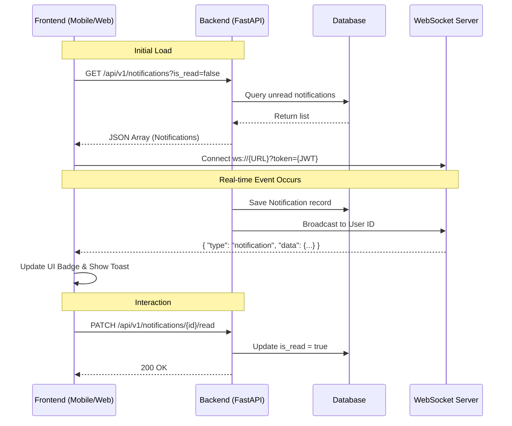

# 📘 Sara Medical: Notification System Integration Guidebook

This guidebook provides frontend developers with the necessary details to integrate the real-time, role-based notification system into the Sara Medical Web and Mobile applications.

---

## 🚀 1. Core Integration Flow

The system uses a **Hybrid Approach**: 
1. **HTTP (REST)**: For fetching historical notifications, marking them as read, and initial unread counts.
2. **WebSocket (WS)**: For real-time "push" alerts while the user is active in the app.

### Sequence Diagram


---

## 👥 2. Role-Based Integration Scenarios

The system triggers different notifications depending on the entity performing an action. Use the table below to understand what to expect for each role.

### Summary Table

| Recipient Role | Event Type | Triggering Action | Expected `action_url` |
| :--- | :--- | :--- | :--- |
| **Doctor** | `appointment_requested` | Patient requests an appointment | `/appointments/{id}` |
| **Doctor** | `access_granted` | Patient approves an AI data access request | `/patients/{id}` |
| **Doctor** | `urgent_task` | Hospital/Admin creates an urgent priority task | `/tasks/{id}` |
| **Patient** | `appointment_approved` | Doctor accepts an appointment request | `/appointments/{id}` |
| **Patient** | `access_requested` | Doctor requests permission to view AI data | `/permissions` |
| **Hospital** | `appointment_requested` | Patient requests appointment at their clinic | `/admin/appointments` |
| **Hospital** | `urgent_task` | Doctor creates an urgent task in the org | `/admin/tasks` |
| **Admin** | `calendar_event` | System/User creates a global calendar event | `/calendar` |

---

## 📡 3. WebSocket API Specification

### Connection URL
`ws://<backend_host>/api/v1/ws?token=<jwt_token>`

### Inbound Message (Push)
When a new event occurs, the server sends:
```json
{
  "type": "notification",
  "data": {
    "id": "e2f1...",
    "type": "appointment_approved",
    "title": "Appointment Approved! 🏥",
    "message": "Dr. Ayush has accepted your checkup request.",
    "is_read": false,
    "action_url": "/appointments/e2f1...",
    "created_at": "2026-03-05T17:05:10Z"
  }
}
```

---

## 🛠️ 4. REST API Specification

### A. Fetch Unread Notifications
**`GET /api/v1/notifications?is_read=false&limit=20`**
- **Purpose**: Call this during the login/initialization phase to populate the notification drawer.
- **Output**: Array of notification objects.

### B. Mark Single Notification as Read
**`PATCH /api/v1/notifications/{id}/read`**
- **Purpose**: Call this when a user clicks on a specific notification in the list.
- **Output**: `{ "success": true, "message": "Notification marked as read" }`

### C. Mark All as Read
**`PATCH /api/v1/notifications/read-all`**
- **Purpose**: Call this if the user clicks a "Clear All" or "Mark all as Read" button.
- **Output**: `{ "success": true, "message": "All notifications marked as read", "count": 12 }`

---

## 🎨 5. Frontend Implementation Tips

### 1. The "Toast" Logic
When a message arrives via WebSocket:
1. Parse the `data.title` and `data.message`.
2. Display a snackbar/toast at the top of the screen.
3. If clicked, use the `data.action_url` to navigate.

### 2. The "Badge" Persistence
Instead of re-fetching the count constantly:
- On load: `unreadCount = initial_fetch.length`.
- On WS message: `unreadCount += 1`.
- On "Mark Read": `unreadCount -= 1`.

### 3. Handling `action_url`
The `action_url` is a path relative to your frontend application's base URL. 
- **Web**: Use `router.push(notification.action_url)`.
- **Mobile**: Map the string values to your screen names (e.g., `/appointments/` -> `AppointmentDetailScreen`).

---

## 🔒 6. Security Note
- Notifications are strictly isolated by **`user_id`**.
- Cross-role notifications (e.g., Doctor notifying Patient) are handled safely on the backend within the service layer.
- WebSocket connections are secured with the same JWT used for API calls.
